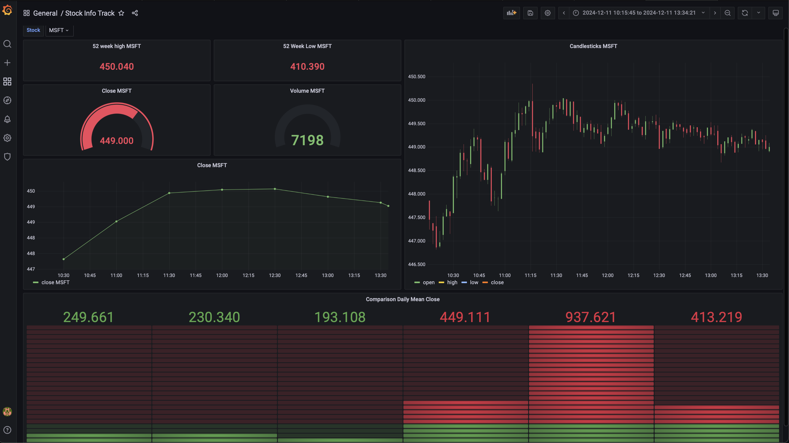
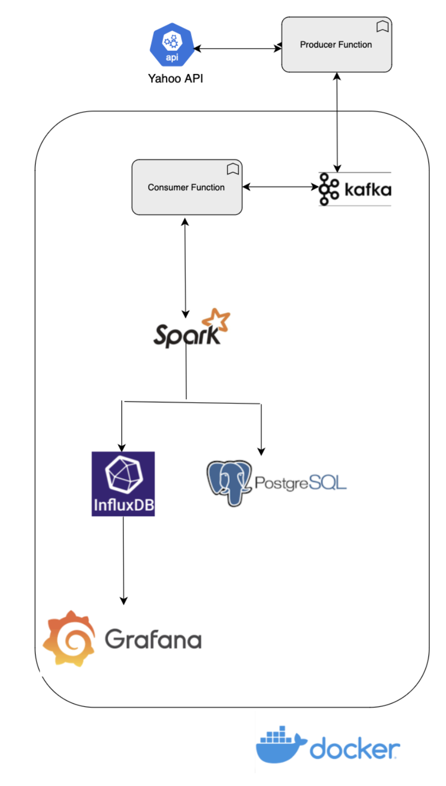

# StockStream - Distributed Real-Time Analytics Platform

## Overview

**StockStream** is a distributed real-time analytics platform designed to process and analyze streaming stock market data at scale. The system leverages Apache Kafka and Apache Spark to build a robust event streaming pipeline capable of processing thousands of events per second with low latency. It features a hybrid storage architecture combining PostgreSQL (with optimized indexes) and InfluxDB (time-series database) for scalable analytics. The platform includes consumer groups for distributed processing, rule-based alerting for anomaly detection, backpressure handling for burst traffic, and Grafana dashboards for real-time monitoring and visualization.

## Table of Contents

- [Key Features](#key-features)
- [Commands to Run the Project](#commands-to-run-the-project)
- [Project Structure](#project-structure)
- [Project Components](#project-components)
- [Data Flow](#data-flow)
- [Rule-Based Alerting](#rule-based-alerting)
- [Performance Optimizations](#performance-optimizations)
- [Dashboard Preview](#dashboard-preview)
- [Project Architecture](#project-architecture)
- [Configuration](#configuration)

## Key Features

### 🚀 Distributed Event Streaming Pipeline
- **Apache Kafka**: Multi-partition topics for parallel processing (4 partitions per topic)
- **Apache Spark Structured Streaming**: Real-time data processing with low latency
- **Consumer Groups**: Distributed processing with `stock-stream-consumer-group` for fault tolerance and scalability
- **Backpressure Control**: `maxOffsetsPerTrigger` configuration to handle burst traffic gracefully

### 💾 Hybrid Storage Architecture
- **PostgreSQL**: Relational storage for stock metadata with optimized indexes
  - Indexed columns: Symbol, Date, Sector, Industry
  - Composite index on (Symbol, Date) for efficient time-series queries
- **InfluxDB**: Time-series database for high-frequency stock price data
  - Optimized for time-series queries and aggregations
  - Efficient storage compression for historical data

### 🔔 Rule-Based Alerting System
Automated monitoring with configurable alert rules:
- **Price Drop Alert**: Triggers when stock price drops by threshold percentage (default: 5%)
- **Price Spike Alert**: Detects significant price increases
- **High Volume Alert**: Monitors unusual trading volume
- **Volatility Alert**: Identifies high volatility periods (high-low spread)

All alerts are logged with severity levels (INFO, MEDIUM, HIGH) and timestamps for audit trails.

### 📊 Real-Time Visualization
- **Grafana Dashboards**: Interactive visualizations connected to InfluxDB
- Real-time stock price monitoring
- Historical trend analysis
- Alert visualization and monitoring

### ⚡ Performance & Reliability
- **Low Latency Processing**: Optimized Spark streaming with checkpoint recovery
- **Burst Traffic Handling**: Backpressure mechanisms prevent system overload
- **Fault Tolerance**: Consumer group offsets and Spark checkpointing for recovery
- **Scalability**: Horizontal scaling with Kafka partitions and Spark workers

## Commands to Run the Project

Before running the project, ensure you have the following tools installed and configured on your system:

- **Python**: Version 3.10.16
- **Pip**: Version 23.0.1
- **Docker**: Version 25.0.3
- **Docker Compose**: Included in Docker 25.0.3
- **Kafka, Spark, InfluxDB, and Grafana**: Docker images will be automatically pulled by the Docker Compose file.

Follow the steps below to set up and run the project:

1. **Start Docker Containers**:
   Inside the parent directory, run:
   ```bash
   docker-compose up -d
   ```

2. **Install Python Dependencies**:
   Install the required Python packages:
   ```bash
   pip install -r requirements.txt
   ```

3. **Run the Producer**:
   Navigate to the producer directory and start the producer script:
   ```bash
   cd producer
   python producer.py
   ```

4. **Run the Consumer with Spark**:
   Open a new terminal, navigate to the project root directory, and execute the following command to run the consumer script with Spark:
   ```bash
   docker exec -it ktech_spark_submit bash -c "spark-submit --master spark://spark-master:7077 \
       --packages org.apache.spark:spark-sql-kafka-0-10_2.12:3.3.3 \
       --jars /opt/bitnami/spark/jars/postgresql-42.5.4.jar \
       /app/consumer/consumer.py"
   ```

By following these steps, you can fully set up and run the project in a containerized environment.

## Project Structure

The project structure is organized as follows, highlighting the code flow:
```
├── producer/
│   ├── producer.py            # Main producer script for stock data
│   ├── producer_utils.py      # Helper functions for producer operations
│   ├── stock_info_producer.py # Produces stock metadata and sends to Kafka or PostgreSQL
│
├── consumer/
│   ├── consumer.py            # Spark Streaming consumer for processing Kafka data
│   ├── InfluxDBWriter.py      # Writes transformed data to InfluxDB
│   ├── alert_rules.py         # Rule-based alerting engine for monitoring
│
├── script/
│   ├── initdb.sql             # PostgreSQL initialization with optimized indexes
│   ├── utils.py               # Utility functions
│
├── logs/                      # Log files generated by the application
│   ├── producer.log           # Logs for producer operations
│   ├── consumer.log           # Logs for consumer operations
│   ├── alerts.log             # Logs for triggered alerts
│
├── docker-compose.yml         # Docker Compose configuration file
├── .env                       # Environment variables for the project
├── README.md                  # Project documentation (this file)
```

## Project Components

1. **Apache Kafka**: 
   Kafka serves as the backbone for data streaming. It manages the flow of real-time stock data between producers and consumers, ensuring fault tolerance and scalability.

2. **Producers**: 
   Producers fetch and format stock data using APIs like yfinance. The formatted data is sent to Kafka for distribution.

3. **Spark Streaming (Kafka Consumer)**: 
   Spark processes the data received from Kafka in real time, transforming it into meaningful insights. Features include:
   - Consumer group configuration for distributed processing
   - Backpressure control (`maxOffsetsPerTrigger`) for handling burst traffic
   - Checkpoint-based recovery for fault tolerance

4. **InfluxDB**: 
   InfluxDB is a time-series database optimized for storing and querying high-frequency stock price data with efficient compression and time-based indexing.

5. **PostgreSQL**: 
   PostgreSQL manages structured data like stock metadata with optimized indexes on Symbol, Date, Sector, and Industry columns for fast query performance.

6. **Alert Engine**: 
   Rule-based alerting system that monitors stock data in real-time and triggers alerts based on configurable thresholds:
   - Price drops/spikes
   - High trading volume
   - Volatility detection

7. **Grafana**: 
   Grafana visualizes the data stored in InfluxDB through interactive dashboards, enabling real-time monitoring and decision-making.

## Data Flow

1. **Data Collection**:
   - Producers fetch stock data using the yfinance library.
   - Two types of data:
     - Real-Time Stock Prices: Sent to `real-time-stock-prices` Kafka topic.
     - Stock Metadata: Sent to `stock-general-information` Kafka topic or PostgreSQL.

2. **Data Streaming**:
   - Apache Kafka acts as the central hub for streaming data between producers and consumers.

3. **Real-Time Processing**:
   - Spark Structured Streaming consumes data from Kafka topics.
   - Data is parsed, validated, and transformed into meaningful metrics (e.g., moving averages).

4. **Data Storage**:
   - Time-series data is written to InfluxDB.
   - Structured metadata is stored in PostgreSQL.

5. **Alerting & Monitoring**:
   - Alert engine evaluates each data point against configured rules
   - Alerts logged with severity levels and timestamps
   - Historical alert data maintained for analysis

6. **Visualization**:
   - Grafana reads time-series data from InfluxDB and provides interactive dashboards.

## Rule-Based Alerting

The platform includes a sophisticated alerting system that monitors stock data in real-time:

### Alert Types

1. **Price Drop Alert**
   - Triggers when stock price drops by ≥5% (configurable)
   - Severity: HIGH
   - Use case: Identify potential sell signals or market downturns

2. **Price Spike Alert**
   - Triggers when stock price increases by ≥5% (configurable)
   - Severity: MEDIUM
   - Use case: Detect rapid growth or unusual buying activity

3. **High Volume Alert**
   - Triggers when trading volume exceeds 1M shares (configurable)
   - Severity: INFO
   - Use case: Identify increased market interest

4. **Volatility Alert**
   - Triggers when intraday volatility (high-low spread) exceeds 3% (configurable)
   - Severity: MEDIUM
   - Use case: Monitor market instability

### Alert Configuration

Alerts are logged to `logs/alerts.log` and can be configured in `consumer/alert_rules.py`:

```python
# Customize thresholds
PriceDropAlert(threshold_percent=3.0)  # Trigger at 3% drop
HighVolumeAlert(threshold_volume=500000)  # Trigger at 500K volume
```

## Performance Optimizations

### Low Latency Processing
- **Kafka Partitioning**: 4 partitions per topic for parallel processing
- **Spark In-Memory Processing**: DataFrame operations for sub-second latency
- **InfluxDB Time-Series Optimization**: Efficient compression and indexing

### Burst Traffic Handling
- **Backpressure Control**: `maxOffsetsPerTrigger` limits batch size to prevent overload
- **Consumer Group Management**: Automatic rebalancing and offset management
- **Checkpoint Recovery**: Fault-tolerant processing with state recovery

### Query Optimization
- **PostgreSQL Indexes**: 
  ```sql
  CREATE INDEX idx_stock_symbol ON stock_info(Symbol);
  CREATE INDEX idx_stock_date ON stock_info(Entry_Date);
  CREATE INDEX idx_stock_symbol_date ON stock_info(Symbol, Entry_Date);
  ```
- **InfluxDB Tags**: Stock symbols stored as tags for fast filtering
- **Time-Based Partitioning**: Automatic data retention and downsampling

### Scalability
- **Horizontal Scaling**: Add Spark workers to increase processing capacity
- **Kafka Consumer Groups**: Multiple consumers can process data in parallel
- **Stateless Processing**: Easy to scale up/down based on load

## Dashboard Preview

The real-time stock monitoring dashboard provides a comprehensive view of stock prices, trends, and aggregated metrics. Below is a preview:





This dashboard allows users to track real-time stock price changes, analyze trends, and make informed decisions.

## Project Architecture

The architecture of this project integrates multiple components to ensure efficient real-time data streaming, processing, storage, and visualization. Below is the architecture diagram:





### Key Highlights:
- **Producers** fetch data from APIs and publish to Kafka topics with partitioning
- **Kafka** serves as the distributed message broker with consumer groups for scalability
- **Spark Streaming** processes data in real time with backpressure control and checkpointing
- **Alert Engine** monitors data streams and triggers rule-based alerts
- **Hybrid Storage** leverages PostgreSQL (indexed queries) and InfluxDB (time-series optimization)
- **Grafana** visualizes the data stored in InfluxDB for real-time monitoring

## Configuration

### Docker Services Configuration
Configuration for various services can be found in `docker-compose.yml`:
- **Kafka**: 4 partitions per topic, auto-create topics enabled
- **Spark**: Master-worker architecture with configurable memory/cores
- **PostgreSQL**: Auto-initialization with indexed schema
- **InfluxDB**: Time-series storage with bucket configuration
- **Grafana**: Connected to InfluxDB for visualization

### Environment Variables
Configure the following in the `.env` file:
- `INFLUXDB_BUCKET`: InfluxDB bucket name
- `INFLUXDB_MEASUREMENT`: Measurement name for stock data
- `INFLUX_ORG`: InfluxDB organization
- `INFLUX_TOKEN`: Authentication token
- `POSTGRES_USER`, `POSTGRES_PASSWORD`: Database credentials
- `STOCKS`: Comma-separated list of stock symbols to monitor

### Alert Configuration
Customize alert thresholds in `consumer/alert_rules.py`:
```python
# Adjust sensitivity
PriceDropAlert(threshold_percent=5.0)
PriceSpikeAlert(threshold_percent=5.0)
HighVolumeAlert(threshold_volume=1000000)
VolatilityAlert(threshold_percent=3.0)
```

### Performance Tuning
Adjust Spark consumer settings in `consumer/consumer.py`:
```python
.option("maxOffsetsPerTrigger", "10000")  # Backpressure control
.option("kafka.group.id", "stock-stream-consumer-group")  # Consumer group
```
